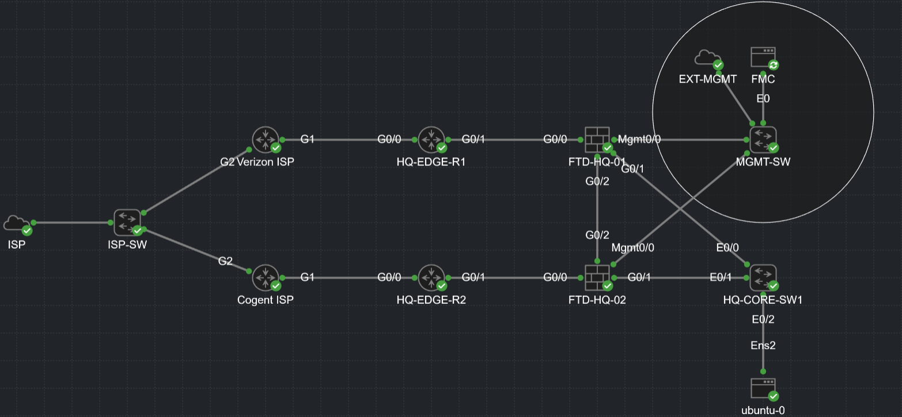

# Cisco FTD + FMC Enterprise Security Lab

This project walks through building a full **Cisco Firepower Threat Defense (FTD)** firewall and managing it using **Firepower Management Center (FMC)**—just like in enterprise environments.

The goal of this lab is to demonstrate essential firewall engineering skills:

- FMC centralized management  
- Access Control Policies (ACP)  
- NAT (Dynamic, PAT, Static)  
- Intrusion Prevention (IPS)  
- URL & File/Malware inspection  
- Traffic visibility and event analysis  
- Realistic troubleshooting workflows  

This repository is structured to be clear, professional, and easy to follow.

---

# 📌 Table of Contents

- [Overview](#overview)
- [Lab Architecture](#lab-architecture)
- [Exported Lab Files](#exported-lab-files)
- [Documentation](#documentation)
- [Configurations](#configurations)
- [Testing Tools](#testing-tools)
- [Skills Demonstrated](#skills-demonstrated)
- [Future Enhancements](#future-enhancements)

---

# 🧱 Overview

Cisco FTD combines:

- Stateful firewalling  
- Intrusion Prevention (Snort)  
- Application control  
- URL filtering  
- Malware/file analysis  
- VPN  
- NAT  

FMC provides centralized management for all Firepower devices, including logging, policy deployment, analytics, and event visibility.

This lab replicates a real-world environment on a manageable, homelab-friendly scale.

---

# 🧩 Lab Architecture

Below is the full enterprise-style topology used in this Firepower lab:

**Figure 1 — Cisco FTD + FMC enterprise lab topology**

---

# 📦 Exported Lab Files

To make this lab fully reproducible and transparent, several exports from FMC and CML are included in the repository.

## 🔹 FMC Policy Export  

This package contains:

- Access Control Policy (ACP)  
- NAT policy  
- Intrusion (IPS) policy  
- Platform settings (logging, syslog, SNMP)  
- Alert configurations  

Download:

- **[FMC Policy Export (.sfo)](exports/FMC-Policy-Export.sfo)**

Import into FMC via:
System → Tools → Import/Export → Upload Package

---

## 🔹 CML Topology Export

The full network topology for Cisco Modeling Labs (CML) is provided as YAML:

- **[FTD-FMC Lab Topology (YAML)](exports/FTD-FMC-lab-cml-topology.yaml)**

This recreates:

- ISP paths  
- Edge routers  
- FTD firewalls (HQ-01, HQ-02)  
- Management switch  
- FMC server  
- Inside LAN + test client  

Import via:
CML → File → Import → Select YAML File

---

## 🧩 Why These Exports Matter

Including exported files makes the repo:

- **Reproducible** — anyone can recreate your environment  
- **Auditable** — reviewers can inspect actual configuration  
- **Professional** — mirrors real enterprise change-control documentation  
- **Extensible** — future upgrades reuse the same topology (VPN, SSL decrypt, HA)  

These exports complete the end-to-end documentation for the Firepower Enterprise Lab.

---

# 📚 Documentation

All major configuration stages are organized inside the `/docs` folder:

- `01-overview.md`  
- `02-lab-architecture.md`  
- `03-ftd-day0-setup.md`  
- `04-fmc-setup-and-registration.md`  
- `05-access-control-policy.md`  
- `06-nat-configuration.md`  
- `07-testing-and-event-analysis.md`  
- `08-troubleshooting.md`  
- `09-device-inventory.md`  
- `10-deployment-workflow.md`  
- `11-how-to-reproduce-this-lab.md`  

Each file explains a separate operational stage of the build.

---

# 🛠 Configurations

Inside `/configs`, you’ll find:

- FTD Day-0 setup  
- Bootstrap templates  
- Registration key examples  
- NAT configurations  
- ACP examples  
- Optional VPN configs  

(All sanitized for security.)

---

# 🧪 Testing Tools

Inside `/scripts`, you will find:

- Traffic generation scripts  
- NAT validation scripts  
- URL category test scripts  
- Safe IPS trigger tests  
- Packet capture helpers  

These help validate policy behavior and study event telemetry in FMC.

---

# 🧠 Skills Demonstrated

This project highlights practical skills including:

## Network Security
- Stateful firewall concepts  
- NAT (PAT, static, identity)  
- IPS / URL filtering  
- Malware/File inspection  
- Log interpretation  

## Cisco Firepower Platform  
- FTD onboarding  
- FMC management  
- ACP design  
- Policy deployment workflow  

## Professional Documentation  
- Structured repo layout  
- Step-by-step implementation  
- Reproducible topology  
- Exported configurations  

---

# 🚀 Future Enhancements

Planned updates:

- AnyConnect VPN  
- Identity-based rules  
- SSL decryption  
- Threat Intelligence feeds  
- SIEM integration (Security Onion / Wazuh)  
- Multi-site topology with branch FTDs  

---

This lab reflects practical skills in deploying and managing Cisco Firepower in an enterprise-style environment.

